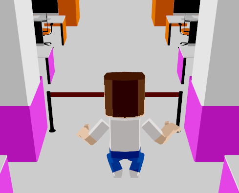
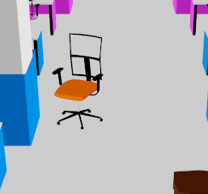
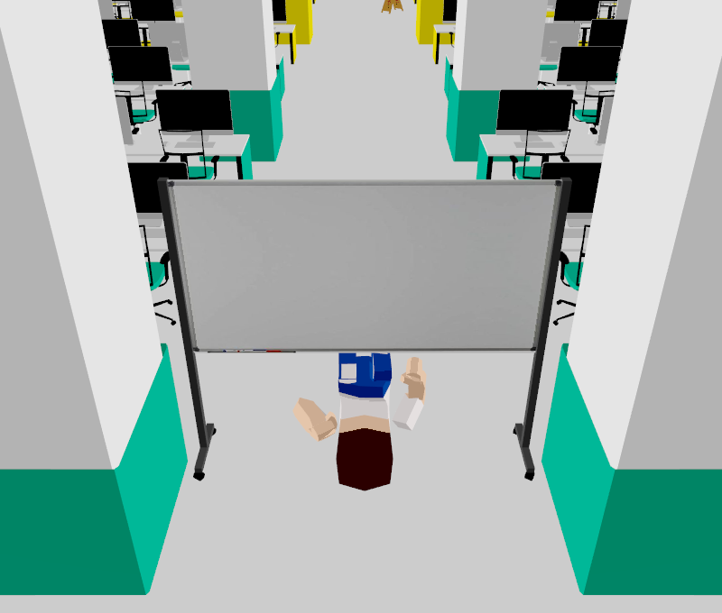
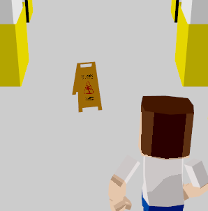
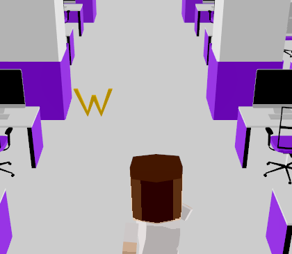

# 42run

Игра раннер написаная на языке Java с использыванием OpenGL

## Сборка и запуск

Длятого чтобы собрать игру запустите

    mvn package

После сборки `.jar` файл будет лежать в папке `target`

Чтобы запустить из консоли

    java -jar .\target\42run-1.0.jar

## Управление

### Для игры

`a` - движение влево\
`s` - кувырок\
`d` - движение вправо\
`space` - прыжок

### Для осмотра

`←` - камера влево\
`↑` - камера вперед\
`→` - камера вправо\
`↓` - камера назад\
`shift` - камера вверх\
`ctrl` - камера вниз

## Объекты

"Забор" - преграда через которую нужно перепрыгивать

Компьютерное кресло - объект который надо объходить сбоку

Доска - объкект который нужно проходть кувырком

Знак "Мокрый пол" - объект который можно как обойти так и перепрыгнуть, если его задеть то персонаж ненадолго замедлится

"Wallet" - монеты которая дает 50 очков

## Немного геймплея :)

